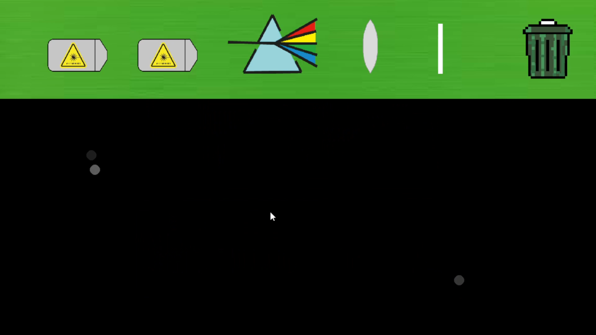
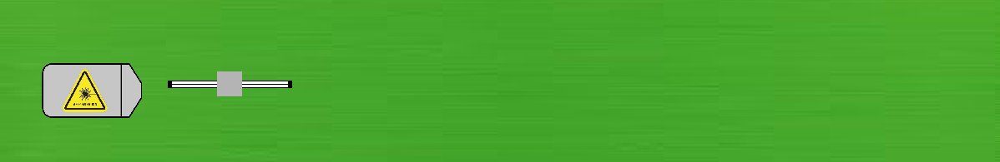
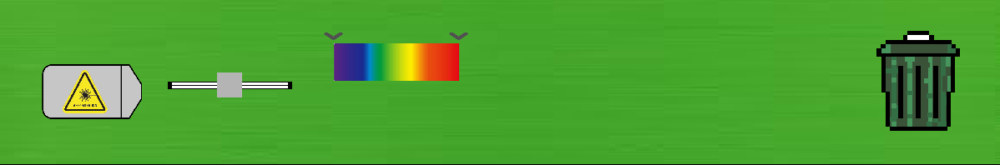
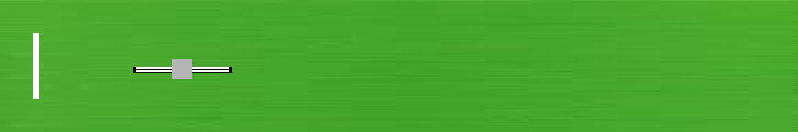
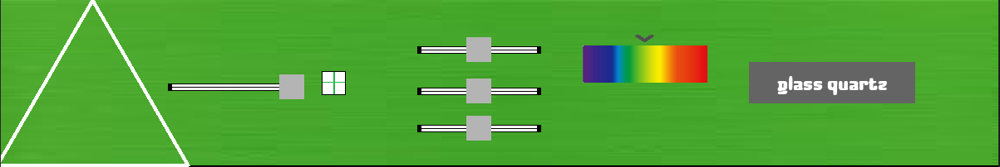
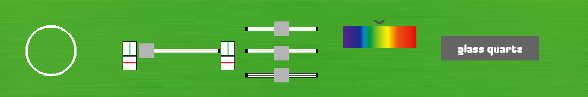

# Optyka

## Wstęp
Aplikacja została stworzona na potrzeby konkursu „Motorola Science Cup” przez drużynę: "if matinf==True: plaze=0".
Nasza aplikacja służy do przeprowadzania prostych symulacyj optycznych odwzorowując zachowania światła w prawdziwym życiu. 

## Do naszego projektu wykorzystaliśmy:
- Prawo snalla
- Prawo odbicia
- Funkcje dyspresji szkła kwarcowego, fluorytu oraz soli kuchennej

## Instrukcja:
### Kolejno od lewej znajdują sję:
Czerwony laser, źródło światła, pryzmat, soczewka, lustro, śmietnik

### Dodawanie obiektu do symulacji:
W celu dodania obiektu należy wybrać jego ikonę, dostosować parametry obiektu przy pomocy suwaków oraz guzików (kazdy obiekt ma indywidualne parametry więcej o tym później). Po dostosowaniu obiektu, należy kliknąć na jego ikonę lewym przyciskiem myszy, co podowuje podniesienie obiektu. Od tego momentu obiekt podąża za kursorem myszy. Jedyne co pozostało do zrobienia, to ustawienie obiektu w pożądanym miejscu oraz dostosowanie nachylenia przy pomocy strzałek w górę oraz w dół (dotyczy zwierciadła oraz źródeł światła). Jako ostatni krok wystarczy kliknąć prawym przyciskiem myszy aby odstawić obiekt.

### Dostosowywanie obiektów:
**Laser**: posiada jeden suwak który służy do regulacji ilości snopów światła (od 1 do 10).

**Żródło światła**: posiada jeden suwak  który zmienia grubość snopu światła oraz kolorowy pasek który zmienia zakres fal światła.

**Zwierciadło** posiada suwak służący do regulacji jego
długości.

**Pryzmat** ma takie same suwaki jak soczewka, nie licząc pierwszego suwaka od lewej, który zmienia długość boku pryzmatu, można dostosowywać jego kolor przy pomocy kolorowego suwaka, wybrać materiał szarym przyciskiem po prawej, aby zresetować ustawienia koloru wystarczy kliknąć przycisk "w" i na koniec, guzikiem z ikoną "plusa" "podnieść" obiekt.

**Soczewka** posiada 4 suwaki - Pierwszy po lewej służy do regulacji szerokości soczewki, pierwszy od góry odpowiada za współczynnik odbicia (0% - 100%), drugi od góry zmienia przepuszczalność (0% - 100%) i na końcu trzeci od góry regulujący współczynnik załamania, klawiszami wsad (lub przyciskami z ikoną plusa i minusa obok suwaka) można mozna zmieniać długość promienia soczewki, strzałki w góre, dól lewo oraz prawo regulują wypukłość soczewki, natomiast klawisze f oraz p stwarzają półpłaskie soczewki, i na koniec klawisz "b" resetuje ustawienia koloru.

### Edycja pryzmatu i soczewki w czasie rzeczywistym
Postawiony już w symulacji **pryzmat** i **soczewkę** można edytować poprzez kliknięcie prawym przyciskiem myszy na dany obiekt. Edytowalne parametry to: współczynnik odbicia (0% - 100%), przepuszczalność (0% - 100%), współczynnik załamania (1-3), materiał, oraz kolor.

### Filmik na youtube prezentujący działanie programu
https://youtu.be/xnDc_m12VfE

## Zespół
Jan Świsłowski - kapitan zespołu  
Oleg Ramanchyk  
Krystian Wieszniewski  
Maks Szulc   
Agata Richter

## Licencja i prawa autorskie
- Wszystkie grafiki wykonaliśmy sami
- Czcionki pobarliśmy ze stron zezwalających na użytkowanie komercyjne ich czcionek za darmo

### Część plików z naszego projektu wyświetla się jako niebezpieczne, ale gwarantujemy ze nie jest to żaden wirus, prosimy o zaufanie i przepraszamy za utrudnienia :).

