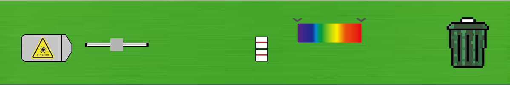

# Optyka

## Wstęp
aplikacja została stworzona na potrzeby konkursu „Motorola Science Cup” przez drużynę if matinf==True: plaze=0. 
Nasza aplikacja służy do przeprowadzania prostych symulacyj optycznych odwzorowując zachowania światła w prawdziwym życiu. 

## Do naszego projektu wykorzystaliśmy:
- Prawo snalla
- Prawo odbicia
- Funkcje refrakcji szkła kwarcowego
- Wzór dyspersji swiatla

## Instrukcja:
### Kolejno od lewej znajdują sję:
Czerwony laser, białe światło, pryzmat, soczewka, lustro, śmietnik

### Dodawanie obiektu do symulacji:
W celu dodania obiektu należy wybrać jego ikonę dostosować parametry obiektu przy pomocy suwaków oraz guzików (kazdy obiekt ma indywidualne parametry więcej o tym później). Po dostosowaniu obiektu należy kliknąć na jego ikonę lewym przyciskiem myszy co podowuje podniesienie obiektu. Od tego momentu obiekt podąża za kursorem myszy. Jedyne co pozostało do zrobienia to ustawienie obiektu w pożądanym miejscu oraz dostosowanie nachylenia przy pomocy strzałek w górę oraz w dół (dotyczy zwierciadła oraz źródeł światła). Jako ostatni krok wystarczy kliknąć prawym przyciskiem myszy aby odstawić obiekt.

### Dostosowywanie obiektów:

**Laser**: posiada jeden suwak który służy do regulacji ilości snopów światła (od 1 do 10)  

**Żródło światła**: posiada  

**Zwierciadło** posiada suwak służący do regulacji jego
długości  

**Pryzmat** ma takie same suwaki jak soczewka lecz jego pierwszy suwak od lewej działa troszke inaczej niz w soczewki

**Soczewka** posiada 4 suwaki - pierwszy po lewej służy do regulacji szerokości soczewki,pierwszy od góry odpowiada za współczynnik odbicia (0% - 100%), drugi od góry zmienia przepuszczalność (0% - 100%) i na końcu trzeci od góry regulujący współczynnik załamania, klawiszami wsad można 

### edycja pryzmatu i soczewki w czasie rzeczywistym
postawiony już w symulacji **pryzmat** i **soczewkę** można edytować poprzez kliknięcie prawym przyciskiem myszy na dany obiekt. Edytowalne parametry to: współczynnik odbicia (0% - 100%), przepuszczalność (0% - 100%) oraz współczynnik załamania 

## Zespół
Jan świsłowski - kapitan zespołu  
Oleg ramanchyk  
Krystian Wieszniewski  
Maks Szulc   
Agata Richter  

